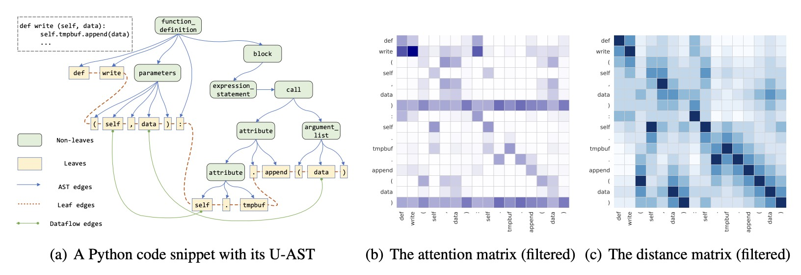

# CAT-probing: A Metric-based Approach to Interpret How Pre-trained Models for Programming Language Attend Code Structure

  

## Updates

- 2022/10/12: Our code is available. 😋
- 2022/10/06: Release the paper of CAT-probing, check out our [paper](https://arxiv.org/abs/2210.04633). 👏
- 2022/10/06: CAT-probing is accepted by **Findings of EMNLP 2022** 🎉

## Introduction

We proposed a metric-based probing method, namely, CAT-probing, to quantitatively evaluate how CodePTMs Attention scores relate to distances between AST nodes.

More details are provided in our EMNLP'22 paper and [our paper on arXiv](https://arxiv.org/abs/2210.04633).

## Environment & Preparing

```bash
conda create --name cat python=3.7
conda activate cat
pip install -r requirements.txt
git clone https://github.com/nchen909/CodeAttention
cd CodeAttention/evaluator/CodeBLEU/parser
bash build.sh
cd ../../../
cp evaluator/CodeBLEU/parser/my-languages.so build/
#make sure git-lfs installed like 'apt-get install git-lfs'
bash get_models.sh
```

### Preparing data

The dataset we use comes from [CodeSearchNet](https://github.com/microsoft/CodeXGLUE/tree/main/Code-Text/code-to-text) and you can download from [Google Drive](https://drive.google.com/drive/folders/1acPGFpw8uJMCdAj7iXkd-_Vq0LjNkaW3?usp=sharing), and add data to `CodeAttention/data`.

### Preparing local path

Direct WORKDIR in run.sh and run_att.sh to your path.

## Using CAT-probing

### Finetune

```bash
export MODEL_NAME=
export TASK="summarize"
export SUB_TASK=
bash run.sh $MODEL_NAME $TASK $SUB_TASK
```

  `MODEL_NAME` can be any one of `["roberta", "codebert", "graphcodebert", "unixcoder"]`.

  `SUB_TASK` can be any one of `["go", "java", "javascript", "python"]`.

### Probing

```bash
# first modify WORKDIR in run_att.sh to yours 
export MODEL_NAME=
export TASK="summarize"
export SUB_TASK=
export LAYER_NUM=
bash run_att.sh $MODEL_NAME $TASK $SUB_TASK $LAYER_NUM
```

`MODEL_NAME` can be any one of `["roberta", "codebert", "graphcodebert", "unixcoder"]`.

`SUB_TASK` can be any one of `["go", "java", "javascript", "python"]`.

`LAYER_NUM` can be any one of `[0-11]` or `-1` (`11` refers to the last layer,  `-1` refers to all `[0-11]` layers).

## Visualization

Visualization results can be found in `att-vis-notebook` folder.



## Citation

Please consider citing us if you find this repository useful.👇

```bibtex
@inproceedings{chen2022cat,
  title={CAT-probing: A Metric-based Approach to Interpret How Pre-trained Models for Programming Language Attend Code Structure},
  author={Chen, Nuo and Sun, Qiushi and Zhu, Renyu and Li, Xiang and Lu, Xuesong and Gao, Ming},
  booktitle = {Proceedings of {EMNLP}},
  year={2022}
}
```

## Acknowledgement

This work has been supported by the National Natural Science Foundation of China under Grant No. U1911203, the National Natural Science Foundation of China under Grant No. 62277017, Alibaba Group through the Alibaba Innovation Research Program, and the National Natural Science Foundation of China under Grant No. 61877018, The Research Project of Shanghai Science and Technology Commission (20dz2260300) and The Fundamental Research Funds for the Central Universities.
